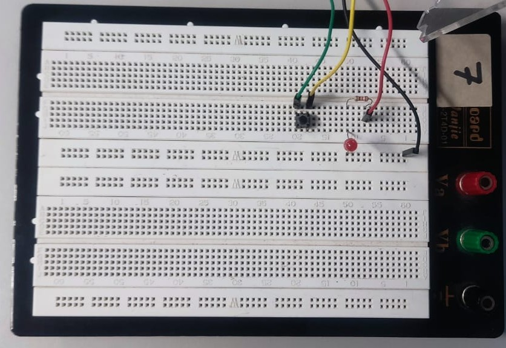
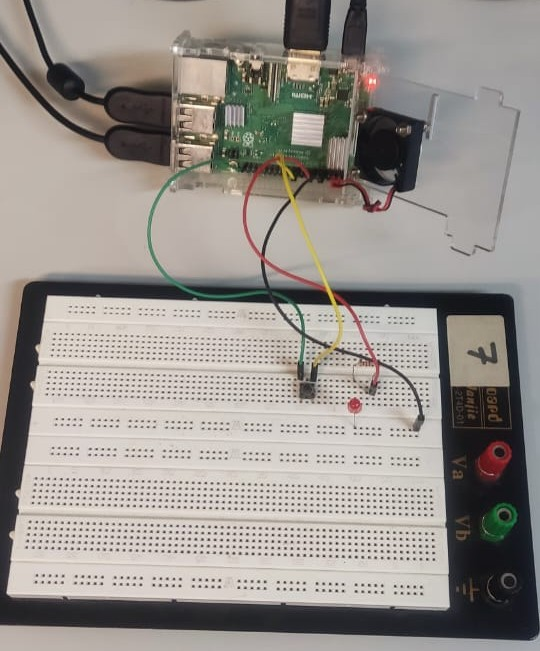

# SBC, GPIO, Python, Protocolos, GitHub e APIs

## Prática 3 - Programação em Python e GPIO

### Autor(es)

- Yuri Thadeu Oliveira Costa
  - N° USP: 14754821
- Fabio Roberto Alcazar Frias Junior
  - N° USP: 14569060

***
***

### Guia da Prática

####

***
***

### Resolução da Pratica

#### PARTE 1

##### Blink Led da Parte 1

```py
from gpiozero import LED, Button
from time import sleep

# Definir pinos
led = LED(17)  # pino GPIO 17
button = Button(2)  # pino GPIO 2

# Definir função para ligar o LED quando o botão for pressionado
def button_pressed():
    led.on()

# Definir função para desligar o LED quando o botão for solto
def button_released():
    led.off()

# Vincular os eventos aos métodos
button.when_pressed = button_pressed
button.when_released = button_released

# Manter o programa rodando
while True:
    sleep(0.1)
```

##### Contagem Regressica da Parte 1

```py
from gpiozero import LED
from time import sleep

# Definir o pino do LED
led = LED(17)

# Função para contagem regressiva
def countdown_timer(seconds):
    while seconds > 0:
        # Mostrar o tempo restante
        print(f"Tempo restante: {seconds} segundos")
        
        # Atualizar o LED com base no tempo
        led.on()  # Acende o LED durante a contagem
        sleep(1)
        led.off()  # Apaga o LED
        sleep(1)
        
        seconds -= 1
    
    print("Contagem regressiva finalizada!")
    led.on()  # Acende o LED ao final

# Entrada de tempo e validação
try:
    time_input = int(input("Digite o tempo para a contagem regressiva (em segundos): "))
    if time_input <= 0:
        print("Por favor, insira um número de segundos positivo.")
    else:
        countdown_timer(time_input)
except ValueError:
    print("Valor inválido! Por favor, insira um número inteiro.")

```

Segue abaixo a montagem do esquematico do circuito, o qual foi apresentado ao professor e se encontra funcionando.

<br>

<figure style="text-align:center; margin: 1em 0;">
  
  <figcaption style="font-size:0.95rem; color:#444; margin-top:0.4em;">
    Figura 1 — Montagem da protoboard.
  </figcaption>
</figure>

<br>

<figure style="text-align:center; margin: 1em 0;">
  
  <figcaption style="font-size:0.95rem; color:#444; margin-top:0.4em;">
    Figura 2 — Montagem da protoboard conectada ao Raspberry Pi 3.
  </figcaption>
</figure>

<br>

#### PARTE 2

