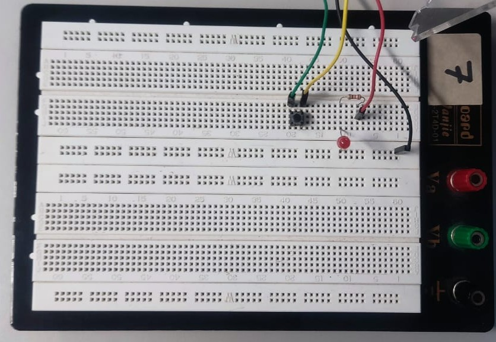
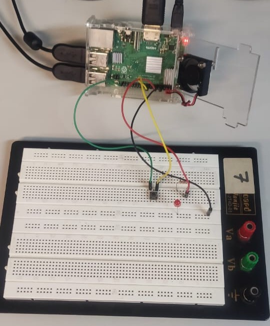
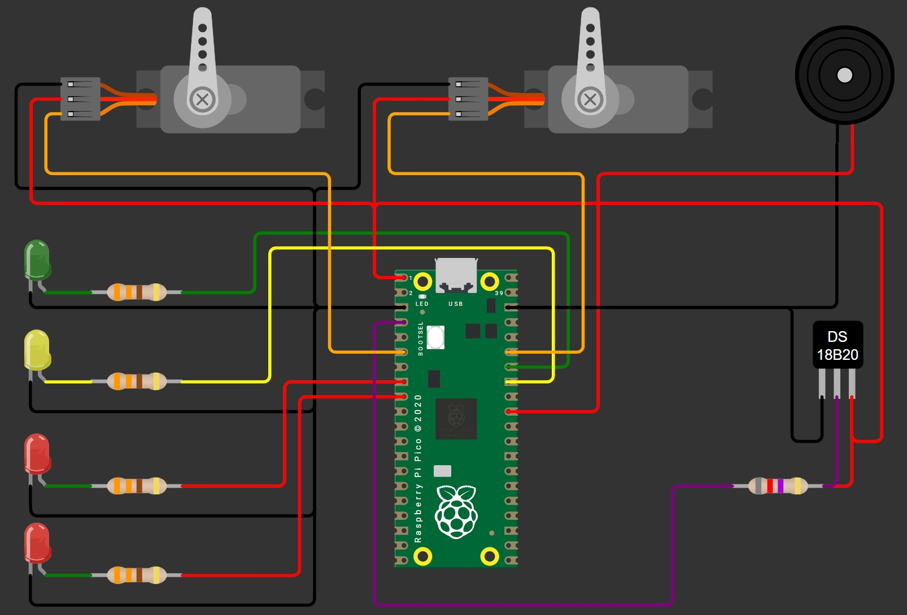

# SBC, GPIO, Python, Protocolos, GitHub e APIs

## Prática 3 - Programação em Python e GPIO

### Autor(es)

- Yuri Thadeu Oliveira Costa
  - N° USP: 14754821
- Fabio Roberto Alcazar Frias Junior
  - N° USP: 14569060

***
***

### Guia da Prática — Visão Geral e Referências

**Roteiro completo:** [SEL0337_Roteiro_Pratica_3.pdf](SEL0337_Roteiro_Pratica_3.pdf)

**Justificativa**  
Esta prática conecta **Python** a **GPIO** em **Linux embarcado (Raspberry Pi)** para criar aplicações reais com sensores e atuadores. O foco é: (1) dominar o ciclo instalação → programação → teste no hardware → documentação; (2) aplicar **PWM** e boas práticas elétricas; (3) entender **concorrência** (threads/processos) para tarefas simultâneas.

**Objetivos de aprendizagem**  

- Python aplicado: condicionais, laços, funções, tratamento de erros, organização de código.  
- GPIO na prática: leitura/escrita digital, eventos por borda, temporização.  
- PWM: frequência e duty cycle para LEDs, buzzer e servos.  
- Integração sensores/atuadores: montagem segura, GND comum, limites de 3,3 V.  
- Concorrência em Linux: threads/processos, sincronização básica, finalização limpa de GPIO.  
- Documentação e versionamento: README, fotos, commits claros.

**Estrutura da Atividade**

**Parte 1 — Python Básico + GPIO (E/S digital)**  

- Revisão de Python; LED “heartbeat”; leitura de **botão** por polling e **evento/borda**; temporizador `MM:SS`; `try/except` e `KeyboardInterrupt`.  
- **Resultados**: scripts limpos com funções e `GPIO.cleanup()`; pinagem documentada e respeito a 3,3 V.  
- **Conteúdo completo:** ver PDF.

**Parte 2 — PWM + Aplicação com Sensores/Atuadores**  

- **PWM**: ajuste de frequência/duty; observação no osciloscópio.  
- Miniaplicação: sensor → lógica → atuação (ex.: distância/temperatura controlando LEDs/buzzer/servo).  
- **Resultados**: parâmetros claros, comentários de segurança, foto/esquema da montagem.  
- **Conteúdo completo:** ver PDF.

**Parte 3 — Concorrência (threads/processos) e Organização**  

- Threads vs processos; noções de escalonamento/preempção; sincronização (mutex/semáforo, nível introdutório).  
- Duas tarefas simultâneas (ex.: piscar LED/servo + leitura de sensor/log); captura de `SIGINT`, *flags* de parada e `join()`.  
- **Resultados**: app estável sem “perder” GPIO; comparação prática entre thread e processo.  
- **Conteúdo completo:** ver PDF.

**Entregáveis (sugestão)**  

- Parte 1: `led_botao.py`, `timer_mmss.py`  
- Parte 2: `pwm_teste.py`, `aplicacao_sensor_atuador.py` (com foto/esquema)  
- Parte 3: `concorrencia.py` (threads/processos, sinais, cleanup)  
- Documentação: `README.md` com **como rodar**, **fotos**, e link para o **roteiro**.

**Como rodar (exemplo)**  

```bash
sudo apt update
sudo apt install -y python3-rpi.gpio
python3 src/parte2/pwm_teste.py
```

*Dica*: alguns testes (ex.: 1-Wire) podem exigir `sudo`. Em `Ctrl+C`, confirme `GPIO.cleanup()`.

**Boas práticas**  

- Fixe pinagem em **constantes** e mantenha um **mapa de pinos** no README.  
- **Nunca** alimente GPIO com 5 V direto; para 5/12 V use **transistor/driver**.  
- Registre **logs** (leituras/estados) para depurar e relatar.  
- Trate erros previsíveis (CRC, timeouts) e use **histerese/debounce** quando necessário.  
- Em concorrência, sempre implemente **sinal de parada**, `join()` e limpeza final.

**Referência (conteúdo completo):** [SEL0337_Roteiro_Pratica_3.pdf](SEL0337_Roteiro_Pratica_3.pdf)

**Sites Úteis**

- [Pinagem Raspibarry Pi](https://pinout-xyz.translate.goog/?_x_tr_sl=en&_x_tr_tl=pt&_x_tr_hl=pt&_x_tr_pto=tc)

- [Como usar o sensorDS18B20](https://raspberrypi-guide.github.io/electronics/temperature-monitoring)

- [Simulação no Worki](https://wokwi.com)

- [Controlando um servo motor](https://www.makerhero.com/blog/controlando-um-servo-motor-com-arduino)

***
***

### Resolução da Pratica

#### PARTE 1 - Uso de GPIO e perifericos

##### Blink Led da Parte 1

**Arquivo de envolvidos:** [pratica3_11.py](pratica3_11.py) e [pratica3_12.py](pratica3_12.py)

```py
from gpiozero import LED, Button
from time import sleep
import os

led = LED(27) # pino GPIO 27
button = Button(22,pull_up=True,bounce_time=0.05) # pino GPIO 10 com pull up ativado

# Definir função para ligar o LED quando o botão for pressionado
def button_pressed():
  led.on()
  os.system("clear")
  print("Botao Pressionado")

# Definir função para desligar o LED quando o botão for solto
def button_released():
  led.off()
  os.system("clear")
  print("Botao Solto")

# quanando pressionar liga, quando soltar desliga
button.when_pressed = button_pressed()
button.when_released = button_released()

while True:
  sleep(0.1)
```

##### Contagem Regressica da Parte 1

```py
from gpiozero import LED
from time import sleep
import os
import sys

# Definir o pino do LED
led = LED(27)

# Função para contagem regressiva
def countdown_timer(total_seconds):
  led.off()
  seconds = int(total_seconds)
  while seconds 0:
    minutos, segundos = divmod(seconds, 60)
    # Formatar MM:SS
    time_str = '{:02d}:{:02d}'.format(minutos, segundos)
    # Imprimir na mesma linha (sobrescreve a linha anterior)
    print(f"Tempo restante: {time_str}", end='\r', flush=True)
    # Piscar o LED durante 1 segundo (0.5s on + 0.5s off)
    sleep(1)

    seconds -= 1

   # Mostrar 00:00 antes de finalizar (garante que usuário veja o zeros
  minutos, segundos = divmod(0, 60)
  print(f"Tempo restante: {'{:02d}:{:02d}'.format(minutos, segundos)}", end='\n', flush=True)

  print("Contagem regressiva finalizada!")
  led.on() # Acende o LED ao final

# Entrada de tempo e validação
while True:
  try:
    try:
      user_input = input("Digite o tempo para a contagem regressiva (em segundos): ")
      # Tentar converter para inteiro (type casting). Isso lança ValueError se inválido.
      time_input = int(user_input)
      os.system('clear')  # limpa tela uma vez antes da contagem
      if time_input <= 0:
        print("Por favor, insira um número de segundos positivo.")
      else:
        countdown_timer(time_input)
        #break  # se eu deixar esse, ele sai do loop após execução, mas vou manter o loop
        # para permitir múltiplas contagens sem reiniciar o programa
    except ValueError:
      os.system('clear')
      print("Valor inválido! Por favor, insira um número inteiro.")
  except KeyboardInterrupt:
    print("\nPrograma encerrado pelo usuário.")
    led.off()  # Apaga o LED ao sair
    break
```

Segue abaixo a montagem do esquematico do circuito, o qual foi apresentado ao professor e se encontra funcionando.

<br>

<figure style="text-align:center; margin: 1em 0;">
  
  <figcaption style="font-size:0.95rem; color:#444; margin-top:0.4em;">
    Figura 1 — Montagem da protoboard.
  </figcaption>
</figure>
<br>

<figure style="text-align:center; margin: 1em 0;">
  
  <figcaption style="font-size:0.95rem; color:#444; margin-top:0.4em;">
    Figura 2 — Montagem da protoboard conectada ao Raspberry Pi 3.
  </figcaption>
</figure>
<br>

##### Histórico de comandos usados no terminal

A sequencia de comandos usados na pratica foram exportados em TXT e o conteuso dele é o que aparece abaixo:

```shell
1 cd
2 ls
3 cd YYFF
4 ls
5 cd pratica3
6 ls
7 python3 -m venv venv
8 source venv/bin/activate
9 sudo apt-get -y  update
10  sudo apt-get -y upgrade
11  pip install gpiozero
12  pip freeze
13  pip install lgpio
14  pip install RPi
15  pip install pigpio
16  pip freeze
17  nano parte11.py
18  nano parte12.py
19  reboot
20  cd
21  ls
22  cd YYFF
23  ls
24  cd pratica3
25  ls
26  source venv/bin/activate
27  pinout
28  python parte11.py
29  clear
30  python parte12.py
31  clear
32  history
```

<br>

Como pode ser visto nesse codigo, foi criado o Ambiente Virtual na Raspbarry Py 3 do laboratório, assim como a instação dos bibliotecas necessárias dentro do ambiente. Todos os codigos foram testados e mostrados para o professor o funcionamento.

Para resolver os requisitos que foram pedido também foram usados os codifos Shell que constam no arquivo [pop_a3.md](pop_a3.md).

Você também pode ver as novas versões dos codigos que estão presentes nos arquivos da [Pratica 3 - Parte 1.1](pratica3_11.py) e nos arquivos da [Pratica 3 - Parte 1.](pratica3_12.py)

<br>

***
***

#### PARTE 2

##### Parte 2.1 — PWM no LED (GPIO18) com varredura suave de brilho

**Arquivo de da Pratica:** [`pratica3_2_PWMled.py`](./pratica3_2_PWMled.py)
Essa pratica de PWM no LED já foi apresentada ao professor e aprovada.

**O que foi implementado**  
Script em Python (RPi.GPIO) que gera **PWM em 1 kHz no GPIO18** para controlar o **brilho de um LED**. O programa realiza uma varredura de **duty cycle 0% → 100% → 0%**, em passos de 5%, produzindo **fade in/out** contínuo e suave.

**Por que isso é importante**  
PWM (*Pulse Width Modulation*) é a técnica padrão para modular potência percebida sem alterar a tensão, sendo eficiente para **LEDs, motores, buzzers e servos**. No LED, variar o **duty** muda a potência média e, portanto, o brilho, evitando aquecimento desnecessário e cintilação quando usada uma frequência adequada.

**Como funciona (resumo do código)**  

- Configura **BCM** e define **GPIO18** como saída.  
- Cria `PWM(PIN=18, FREQ_HZ=1000)` e inicia com **0%** (`pwm.start(0)`).  
- Loop principal:
  - **Sobe** brilho: `ChangeDutyCycle(0..100, passo=5)` com `sleep(0.01)`  
  - **Desce** brilho: `ChangeDutyCycle(100..0, passo=5)` com `sleep(0.01)`  
- Encerramento limpo: captura `KeyboardInterrupt`, executa `pwm.stop()` e `GPIO.cleanup()`.

> **Tempo por ciclo (aprox.)**: 0→100 (21 passos × 10 ms ≈ 210 ms) + 100→0 (≈ 210 ms) → **~420 ms** por ciclo completo.

**Ligação sugerida do LED**  
`GPIO18 → resistor 220–330 Ω → LED → GND`  
> Respeite os limites de **corrente por GPIO (~16 mA)** e **total por porta**. Para LEDs comuns, 220–330 Ω é adequado.

**Parâmetros ajustáveis**  

- `FREQ_HZ`: 500–2000 Hz evitam cintilação perceptível.  
- **Suavidade** da transição: ajuste o **passo** (ex.: 5%) e o **atraso** (ex.: 10 ms).  
- **Curva perceptual**: aplicar “*gamma*” ao duty para um fade mais natural.

**Boas práticas**  

- Sempre finalizar com `GPIO.cleanup()`.  
- Centralizar constantes (pino, frequência, passo, atraso) no topo do script.  
- Documentar pinagem e manter **GND comum** nas montagens.

**Extensões sugeridas**  

- Controlar o duty em tempo real via **potenciômetro + ADC** (ex.: MCP3008).  
- Testar curvas **senoidal/exponencial** para o fade.  
- Validar frequência/duty no **osciloscópio**.  
- Encapsular em **funções/classes** para reuso em outros módulos.

**Variação do duty cycle do sinal PWM e visualização no osciloscópio**


***
***

##### Parte 2.2 — Controle integrado com **DS18B20**, **LEDs**, **Servos** e **Buzzer** (1-Wire + PWM)

**Arquivo de envolvidos:** [`pratica3_2_PWMaplication.py`](pratica3_2_PWMaplication.py)

**Esquemático da montagem:**  


**Vídeo de funcionamento:**  
[▶️ funcionamento_pratica3_2_2.mp4](funcionamento_pratica3_2_2.mp4)

***

###### Introdução

A ideia desta prática é demonstrar, em pequena escala, **como um sistema pode acompanhar e reagir à temperatura** de um equipamento/ambiente.  

- Os **LEDs** comunicam o **estado térmico** (de normal a crítico).  
- Os **servos** representam atuadores que poderiam ser **motores com ventoinhas**: ajustar sua “rotação/posição” conforme a faixa térmica permite **refrigeração sob demanda**, **economizando energia**.  
- O **buzzer** funciona como **alarme** para sinalizar **superaquecimento**, chamando atenção para ações imediatas de segurança.

***

###### O que foi implementado

Integração completa de **sensor de temperatura DS18B20** (1-Wire no **GPIO4**) com **quatro LEDs** (indicação de faixa), **dois servos** (padrões “sweep” e “saw”) e **buzzer** (alerta). O loop principal:

1) **Lê a temperatura** pelo sysfs do 1-Wire;  
2) **Classifica em faixas** (A–E) com **histerese**;  
3) **Aciona LEDs / Servos / Buzzer** conforme a faixa;  
4) **Limpa a tela** e exibe um **painel** com temperatura, faixa + mensagem de status, ângulos e estados dos dispositivos.

***

###### Requisitos e preparo

- **Ativar 1-Wire**: `sudo raspi-config` → *Interface Options* → **1-Wire** → *Enable* → `sudo reboot`.  
  *Sem isso, o DS18B20 não aparece em `/sys/bus/w1/devices/28-*/w1_slave`.*
- **Biblioteca**: `python3-rpi.gpio` (geralmente já presente no Raspberry Pi OS).
- **Servos**: alimentação **5 V em fonte externa** e **GND comum** com a Raspberry Pi.
- **DS18B20 (GPIO4)**: VDD **3.3 V**, GND **GND**, DQ **GPIO4** com **pull-up 4,7 kΩ** para 3.3 V.

***

###### Mapeamento de hardware (BCM)

- **Sensor**: DS18B20 → `/sys/bus/w1/devices/28-*/w1_slave` (1-Wire, **GPIO4**).  
- **LEDs**: Verde (**GPIO27**), Amarelo (**GPIO22**), Vermelho1 (**GPIO23**), Vermelho2 (**GPIO24**).  
- **Buzzer (passivo)**: **GPIO25** (acionamento ON/OFF).  
- **Servos**: **GPIO18** (PWM 50 Hz), **GPIO17** (PWM por software 50 Hz).

***

###### Parâmetros principais do código

- **Leitura de temperatura**: `READ_TEMP_INTERVAL = 0.05 s`.  
- **Passo do loop**: `LOOP_DT = 0.01 s`.  
- **Faixas (°C)**:  
  - A: `T ≤ 20`; B: `20 < T ≤ 40`; C: `40 < T ≤ 60`; D: `60 < T ≤ 80`; E: `T > 80`.  
- **Histerese**: `HYST = 2.0 °C` (evita oscilações entre faixas).  
- **Servos (50 Hz)**: conversão **ângulo 0–180° → duty** com limites **ajustados ao seu hardware**:

  ```python
  SERVO_MIN_DUTY = 12.5
  SERVO_MAX_DUTY = 25.0
  # angle_to_duty(): duty = MIN + (MAX - MIN) * (angle/180)
  ```

**Se houver batida no fim de curso, recalibre** (por exemplo, **2.5–12.5%** é comum em muitos servos).

- **Buzzer**: períodos (usados na faixa E deste código):
  `BUZZER_PERIOD_D = 0.4 s` e `BUZZER_PERIOD_E = 0.2 s` (metade do anterior).

***

###### Lógica por faixa (atuadores neste código)

- **Faixa A (≤ 20 °C)**
  **LEDs**: Verde ligado (outros off) · **Servos**: parados · **Buzzer**: off
  **Mensagem**: “Temperatura baixa e segura.”
- **Faixa B (21–40 °C)**
  **LEDs**: Amarelo ligado · **Servo1**: **sweep 0–90°** · **Servo2**: parado · **Buzzer**: off
  **Mensagem**: “Temperatura normal.”
- **Faixa C (41–60 °C)**
  **LEDs**: Vermelho1 ligado · **Servo1**: **sweep 0–180°** · **Servo2**: parado · **Buzzer**: off
  **Mensagem**: “Temperatura quente: precisa abaixar.”
- **Faixa D (61–80 °C)**
  **LEDs**: Vermelho1 + Vermelho2 **ligados** (fixos) · **Servo1**: **sweep 0–180°** · **Servo2**: **saw 0–180°** · **Buzzer**: **off** *(nesta versão)*
  **Mensagem**: “Temperatura alta: precisa resfriar.”
- **Faixa E (≥ 81 °C)**
  **LEDs**: Vermelho1 + Vermelho2 ligados · **Servos**: ambos **sweep 0–180°** · **Buzzer**: **liga/desliga** a cada `BUZZER_PERIOD_E/2` (buzina **rápida**)
  **Mensagem**: “Temperatura crítica: precisa abaixar rápido!”

> O painel no terminal **limpa a tela** a cada leitura e exibe: caminho do sensor, **temperatura**, **faixa + mensagem**, **ângulos** `a1/a2`, **buzzer ON/OFF** e **estados** dos LEDs.

***

###### Registro e simulação (opcionais)

- **CSV**: com `LOG_CSV=1`, grava `timestamp,temp,faixa` em `temperatura_log.csv`.
- **SIM**: com `SIMULATE=1`, usa **temperatura senoidal** para testes sem o sensor.

***

###### Observações importantes

- **Conversão do DS18B20**: a 12 bits, leva ~**750 ms**. Com `READ_TEMP_INTERVAL=0.05 s`, você re-lê o arquivo mais rápido do que o sensor atualiza; para leituras realmente mais frequentes, **reduza a precisão** (9–10 bits) com biblioteca apropriada ou **aumente** o intervalo.
- **Servos tremendo?** Diminua a velocidade (reduza `deg_per_sec` nas classes `Sweep/Saw`) e/ou ajuste `LOOP_DT`.
- **Segurança elétrica**: respeite **3.3 V nas GPIOs**, use **GND comum**, e alimente **servos em 5 V externo**.

***

###### Como executar

```bash
# (se necessário)
sudo apt update
sudo apt install -y python3-rpi.gpio

# ative 1-Wire pelo raspi-config e reinicie; depois, na pasta do projeto:
python3 pratica3_2_PWMaplication.py
```

***
***
<br>

##### Parte 3 — Threads com PWM e Botão (LEDs nos GPIO27/22 e botão no GPIO2)

**Arquivos envolvidos:** [pratica3_3.py](pratica3_3.py)

**Vídeo de funcionamento:** [▶️ funcionamento_pratica3_3.mp4](funcionamento_pratica3_3.mp4)

***

###### Objetivo
Demonstrar **concorrência com threads** no Raspberry Pi: dois **LEDs** executando **fade PWM** em paralelo, enquanto um **botão** altera **dinamicamente** os parâmetros do PWM de um dos LEDs. A atividade evidencia (i) como **tarefas independentes** podem rodar ao mesmo tempo, (ii) como **entradas** (botão) podem **mudar o comportamento** de uma saída (PWM) **em tempo real**.

***

###### O que o código faz
- **Thread 1 (LED1 – GPIO27):** executa um **fade 0→100→0** com **frequência fixa** e passo/tempo próprios (ex.: 1200 Hz, passo 4%, `dt=0.008 s`).  
- **Thread 2 (LED2 – GPIO22):** executa o mesmo **fade** porém:
  - **Sem botão pressionado:** usa **frequência baixa** (ex.: 200 Hz) e **passo pequeno** (ex.: 5%) — propositalmente **diferentes** do LED1 para facilitar comparação visual.
  - **Botão (GPIO2) pressionado:** alterna para **frequência alta** (ex.: 1500 Hz) **e** aumenta o **passo do duty** para **≥ 3× o inicial** (ex.: 15%) — o fade fica percebivelmente **mais rápido**.
  - **Ao soltar o botão:** retorna aos parâmetros **originais** (200 Hz / passo 5%).
  - A cada transição **pressionar/soltar**, o código **imprime** uma mensagem indicando a nova frequência e passo.
- **Encerramento:** `Ctrl+C` aciona o **evento de parada**, cada thread encerra seu PWM e limpa **apenas** os pinos que usou (`GPIO.cleanup`).

***

###### Ligações (BCM)
- **LED1**: GPIO **27** → **resistor 220–330 Ω** → LED → **GND**  
- **LED2**: GPIO **22** → **resistor 220–330 Ω** → LED → **GND**  
- **Botão**: GPIO **2** (configurado com `PUD_UP`) → **botão** → **GND**

> Com `pull_up` interno habilitado, o pino lê **HIGH** quando solto e **LOW** quando o botão fecha com GND.

***

###### Como executar

```bash
python3 parte3.py
````

- Na inicialização, o terminal mostra a **frequência/passo** de cada thread.
- Pressione o **botão (GPIO2)** para alternar os parâmetros do LED2; observe as **mensagens** no terminal e a mudança do **fade**.
- **Ctrl+C** para sair com limpeza dos pinos.

***

###### Por que configurar parâmetros distintos?

- **Comparação visual imediata**: LED1 começa com **freq. alta** e **passo menor**, enquanto LED2 inicia com **freq. baixa** e **passo maior/diferente** — a diferença é clara **sem** apertar o botão.
- **Demonstração dinâmica**: ao **pressionar** o botão, o LED2 muda para **freq. alta** e **passo ≥3×**, deixando o fade **nitidamente mais rápido**; ao **soltar**, retorna ao perfil **original**.

***

###### Boas práticas adotadas

- **Encapsulamento por thread**: cada “código” (LED1/LED2+botão) tem **constantes e GPIO** definidos **dentro** da função que usa.
- **Limpeza de GPIO por pino**: cada thread faz `cleanup` **apenas** dos pinos que manipula; o `main` faz uma limpeza **defensiva** ao final.
- **Debounce** e leitura robusta do botão: o estado é conferido e as transições são **anunciadas** com prints.

***

###### Evidência de funcionamento

- Consulte o vídeo: **funcionamento_pratica3_3.mp4** — mostra:

  1. Diferença inicial entre LED1 (freq. alta/passo pequeno) e LED2 (freq. baixa/passo distinto).
  2. **Pressionar** o botão: LED2 acelera (freq. alta + passo ≥3×).
  3. **Soltar** o botão: LED2 volta ao perfil original, enquanto LED1 permanece constante.

***
***